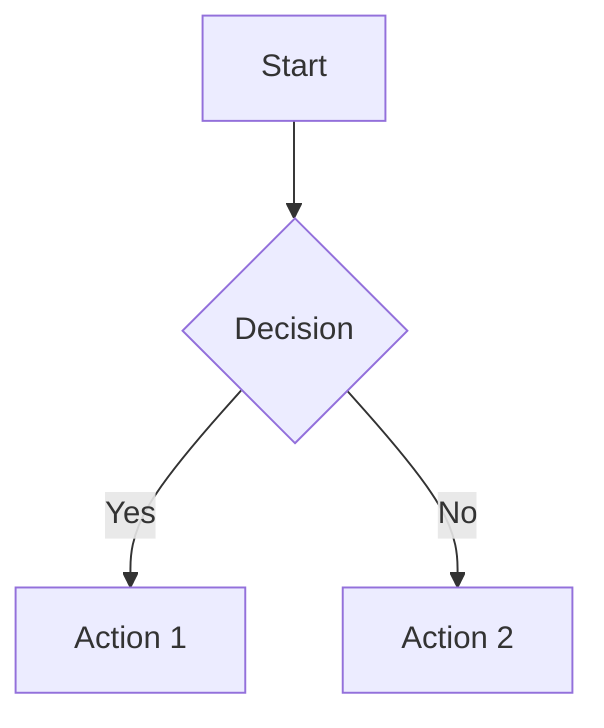

# Nexus Documentation

**Version:** 1.0.0
**A multi-tab Markdown editor with live preview**

Nexus is a modern, feature-rich Markdown editor built with Electron, React, and Material UI (MUI). It provides a seamless editing experience with dual viewing modes, extensive keyboard shortcuts, and a clean, intuitive interface.

---

## Table of Contents

1. [Overview](#overview)
2. [Installation](#installation)
3. [Features](#features)
   - [File Directory Panel](#file-directory-panel)
   - [Dual View Modes](#dual-view-modes)
   - [Multi-Tab Editing](#multi-tab-editing)
   - [File Operations](#file-operations)
   - [Find and Replace](#find-and-replace)
   - [Markdown Formatting Toolbar](#markdown-formatting-toolbar)
   - [reStructuredText Support](#restructuredtext-support)
   - [Mermaid Diagrams](#mermaid-diagrams)
   - [Link Navigation](#link-navigation)
   - [PDF Export](#pdf-export)
   - [Theme Support](#theme-support)
   - [Visual Configuration Menu](#visual-configuration-menu)
   - [Logging](#logging)
4. [AI Features](#ai-features)
   - [Nexus Assistant](#nexus-assistant)
   - [Ask Mode](#ask-mode)
   - [AI Edit Mode](#ai-edit-mode)
   - [Create Mode](#create-mode)
   - [AI Provider Configuration](#ai-provider-configuration)
5. [Keyboard Shortcuts](#keyboard-shortcuts)
6. [Supported File Formats](#supported-file-formats)
7. [Technical Architecture](#technical-architecture)
8. [Building from Source](#building-from-source)

---

## Overview

Nexus is a desktop Markdown editor designed for writers, developers, and anyone who works with Markdown documents. It features:

- **File Directory Panel** - Collapsible sidebar for browsing and managing multiple project folders simultaneously
- **Dual viewing modes** - Switch between raw Markdown editing and rendered preview
- **Multi-tab interface** - Work on multiple documents simultaneously
- **GitHub Flavored Markdown** - Full GFM support including tables, task lists, and strikethrough
- **reStructuredText support** - Full RST rendering with dedicated formatting toolbar
- **Mermaid diagrams** - Embedded diagram support in both Markdown and RST files
- **PDF export** - Export rendered documents to PDF
- **Modern UI** - Built with Material UI for a clean, responsive interface
- **Cross-platform** - Available for Windows, macOS, and Linux

---

## Installation

### Pre-built Binaries

Download the appropriate installer for your platform from the releases page:

- **Windows:** `Nexus-Setup.exe` (installer) or `Nexus-Portable.exe` (portable)
- **macOS:** `Nexus.dmg`
- **Linux:** `Nexus.AppImage` or `Nexus.deb`

### File Associations

Nexus automatically registers as the default handler for markup files:

**Markdown:**

- `.md`, `.markdown`, `.mdown`, `.mkd`, `.mkdn`, `.mdx`, `.mdwn`, `.mdc`

**reStructuredText:**

- `.rst`, `.rest`

Double-clicking any of these file types will open them in Nexus.

---

## Features

### File Directory Panel

The File Directory Panel is a collapsible, resizable left-hand sidebar for browsing and managing one or more project folders directly within the editor.

- **Multiple open directories** - Open any number of folders simultaneously, each with its own tree view and toolbar
- **Full directory tree** - Displays all supported Markdown, RST, and text files recursively, with folders shown before files
- **Double-click to open** - Single-click selects a file; double-click opens it as a new editor tab
- **Per-directory toolbar** - Each directory has its own toolbar with buttons for creating files/folders, sorting, expand/collapse all, and closing
- **File and folder operations** - Create, rename, delete, and move files and folders without leaving the editor
- **Drag-and-drop** - Reorganize files within a directory by dragging them to new folders
- **Right-click context menu** - Rename, delete, reveal in Explorer, copy path/name, and toggle Nexus AI attachment per file or folder
- **Sort order** - Sort files A-to-Z or Z-to-A per directory; sort preference is remembered across sessions
- **Nexus AI integration** - Attach any file in the tree to the Nexus AI chat context without opening it in the editor
- **Auto-restore** - Previously opened directories are automatically re-opened on application startup
- **Recent directories** - Recently opened directories appear on the landing page and in Settings for quick re-access

> For full details, see [File-Directory-Feature.md](File-Directory-Feature.md).

### Dual View Modes

Nexus provides two viewing modes for each document:

#### Edit Mode

- Raw Markdown text editing with a monospace font
- **Line numbers** - A fixed-width gutter along the left edge shows logical line numbers (newline-delimited). The gutter scrolls in sync with the editor and is only visible in Edit mode.
- Syntax-aware editing (list continuation, code block handling)
- Full formatting toolbar access
- Real-time content updates

#### Preview Mode

- Rendered Markdown output
- Styled with proper typography and formatting
- Support for all GFM elements (tables, task lists, code blocks)
- Word highlighting on double-click

**Toggle between modes:**

- Click the mode icon on the tab
- Use keyboard shortcut `Ctrl+E`

### Multi-Tab Editing

Work on multiple documents simultaneously with the tabbed interface:

- **Open multiple files** - Each file opens in its own tab
- **Drag-and-drop reordering** - Reorganize tabs by dragging
- **Tab context menu** - Right-click for additional options:
  - Rename file
  - Open file location in explorer
  - Copy file name (with extension)
  - Copy file path
  - Copy file contents
  - Save As — save a copy to another location without affecting the open file
  - Attach/remove from Nexus AI context
- **Unsaved indicator** - Yellow icon shows files with unsaved changes
- **Per-tab view mode** - Each tab remembers its edit/preview state
- **Scroll position memory** - Maintains scroll position when switching tabs or modes

### File Operations

Access file operations through the toolbar or keyboard shortcuts:

| Operation | Toolbar Icon | Description                                      |
| --------- | ------------ | ------------------------------------------------ |
| New File  | ➕           | Create a new untitled document                   |
| Open File | 📁           | Open existing file(s) with multi-select support  |
| Save      | 💾           | Save current file (prompts for name if untitled) |
| Save All  | 💾+          | Save all files with unsaved changes              |
| Close     | ✕           | Close current tab (prompts to save if dirty)     |
| Close All | ✕✕         | Close all open tabs                              |

**Additional operations:**

- **Save As** - Save with a new filename (via menu)
- **Show in Folder** - Reveal file in system file explorer
- **Rename** - Rename file from tab context menu

### Find, Replace, and Go to Line

A tabbed search panel accessible in both Edit and Preview modes. Open it with `Ctrl+F`, `Ctrl+H`, or `Ctrl+G`, or click the search icon in the toolbar.

#### Find Tab (`Ctrl+F`)

- **Find Next** - Navigate to the next occurrence
- **Count** - Display total number of matches
- **Highlighting** - All matches highlighted in the document
- **Current match indicator** - Active match shown in distinct color
- Press `Enter` to jump to the next match; `Escape` to close the panel

#### Replace Tab (`Ctrl+H`)

- **Replace** - Replace current match and move to next
- **Replace All** - Replace all occurrences at once
- **Match counter** - Shows "X of Y matches" during navigation

> **Note:** Replace operations are only available in Edit mode. In Preview mode, the Replace buttons are disabled with a helpful tooltip.

#### Go to Line Tab (`Ctrl+G`) — Edit mode only

- Jump directly to any line number in the document
- Opens with the line-number input already focused — just type a number and press **Enter** or click **Go**
- The editor scrolls up or down to center the target line and places the cursor at the start of that line
- The **Go to Line** tab is only shown when the file is in Edit mode; it is hidden in Preview mode
- Press `Escape` to close the panel without navigating

### Markdown Formatting Toolbar

In Edit mode, a comprehensive formatting toolbar provides quick access to Markdown syntax:

#### Text Formatting

| Button        | Markdown     | Shortcut   |
| ------------- | ------------ | ---------- |
| Bold          | `**text**` | `Ctrl+B` |
| Italic        | `*text*`   | `Ctrl+I` |
| Strikethrough | `~~text~~` | -          |

#### Headings

| Button | Markdown        |
| ------ | --------------- |
| H1     | `# Heading`   |
| H2     | `## Heading`  |
| H3     | `### Heading` |

#### Code

| Button      | Markdown         |
| ----------- | ---------------- |
| Inline Code | `` `code` ``     |
| Code Block  | ` ```code``` ` |

#### Lists & Structure

| Button        | Markdown       |
| ------------- | -------------- |
| Bulleted List | `- item`     |
| Numbered List | `1. item`    |
| Task List     | `- [ ] task` |
| Quote         | `> quote`    |

#### Links & Media

| Button | Markdown        |
| ------ | --------------- |
| Link   | `[text](url)` |
| Image  | `` |

#### Other

| Button          | Markdown               |
| --------------- | ---------------------- |
| Table           | Inserts table template |
| Horizontal Rule | `---`                |

#### History

| Button | Shortcut                       |
| ------ | ------------------------------ |
| Undo   | `Ctrl+Z`                     |
| Redo   | `Ctrl+Y` or `Ctrl+Shift+Z` |

### reStructuredText Support

Nexus provides full support for reStructuredText (RST) files with live preview rendering and a dedicated formatting toolbar.

#### Supported RST Elements

| Element                    | Syntax                                            | Description                       |
| -------------------------- | ------------------------------------------------- | --------------------------------- |
| **Headings**         | Text with underlines (`=`, `-`, `~`, `^`) | Multiple heading levels supported |
| **Bold**             | `**text**`                                      | Strong emphasis                   |
| **Italic**           | `*text*`                                        | Emphasis                          |
| **Inline Code**      | `` ``code`` ``                                    | Monospace inline text             |
| **Code Blocks**      | `.. code-block:: language`                      | Syntax-highlighted code           |
| **Bullet Lists**     | `* item` or `- item`                          | Unordered lists                   |
| **Numbered Lists**   | `#. item` or `1. item`                        | Auto-numbered or explicit         |
| **Links**            | `` `text <url>`_ ``                               | Inline hyperlinks                 |
| **Images**           | `.. image:: url`                                | Image embedding                   |
| **Block Quotes**     | Indented text                                     | Quoted content                    |
| **Literal Blocks**   | `::` followed by indented text                  | Preformatted text                 |
| **Admonitions**      | `.. note::`, `.. warning::`, etc.             | Callout boxes                     |
| **Horizontal Rules** | `----`                                          | Section dividers                  |

#### RST Formatting Toolbar

When editing RST files, a specialized toolbar appears with RST-specific formatting buttons:

| Button          | Action                       | RST Syntax           |
| --------------- | ---------------------------- | -------------------- |
| Bold            | Insert bold text             | `**text**`         |
| Italic          | Insert italic text           | `*text*`           |
| H1              | Heading with `=` underline | `Title` + `====` |
| H2              | Heading with `-` underline | `Title` + `----` |
| H3              | Heading with `~` underline | `Title` + `~~~~` |
| Code            | Inline code                  | `` ``code`` ``       |
| Code Block      | Code block directive         | `.. code-block::`  |
| Quote           | Block quote                  | Indented text        |
| Bullet List     | Unordered list item          | `* item`           |
| Numbered List   | Auto-numbered item           | `#. item`          |
| Link            | Inline link                  | `` `text <url>`_ ``  |
| Image           | Image directive              | `.. image:: url`   |
| Note            | Note admonition              | `.. note::`        |
| Warning         | Warning admonition           | `.. warning::`     |
| Horizontal Rule | Section divider              | `----`             |

### Mermaid Diagrams

Nexus supports embedded Mermaid diagrams in both Markdown and RST files. Diagrams are rendered live in preview mode.

#### Mermaid in Markdown

Use fenced code blocks with the `mermaid` language identifier:

````markdown

````

#### Mermaid in RST

Use the `code-block` directive with `mermaid` as the language:

```rst
.. code-block:: mermaid

   graph TD
       A[Start] --> B{Decision}
       B -->|Yes| C[Action 1]
       B -->|No| D[Action 2]
```

#### Supported Diagram Types

| Type       | Description                                  |
| ---------- | -------------------------------------------- |
| Flowchart  | `graph TD` or `graph LR` - Flow diagrams |
| Sequence   | `sequenceDiagram` - Interaction sequences  |
| Class      | `classDiagram` - UML class diagrams        |
| State      | `stateDiagram-v2` - State machines         |
| ER Diagram | `erDiagram` - Entity relationships         |
| Gantt      | `gantt` - Project timelines                |
| Pie Chart  | `pie` - Pie charts                         |
| Git Graph  | `gitGraph` - Git branch visualization      |

### Link Navigation

Nexus supports clickable link navigation in Preview mode, allowing you to follow both internal and external links directly from the rendered document.

#### Supported Link Types

| Link Type                  | Example                            | Behavior                             |
| -------------------------- | ---------------------------------- | ------------------------------------ |
| **Internal anchors** | `[Section](#section-name)`       | Smooth scrolls to the target heading |
| **External URLs**    | `[Website](https://example.com)` | Opens in your default browser        |

#### Internal Anchor Links

Clicking a link that starts with `#` navigates to the matching heading within the document:

- Headings automatically generate anchor IDs using a GitHub-style slug format (lowercase, spaces become hyphens, special characters removed)
- Example: A heading `## My Section Title` generates the ID `my-section-title`
- Clicking `[Go to section](#my-section-title)` smoothly scrolls the preview to that heading

#### External URLs

Clicking a link that starts with `http://` or `https://` opens the URL in your system's default web browser. The link opens externally so you stay in Nexus without interruption.

> **Note:** Link navigation is available in Preview mode only. In Edit mode, links are displayed as raw Markdown syntax.

### PDF Export

Nexus can export documents to PDF format:

- Click the **PDF export** icon in the toolbar while viewing a document
- The rendered preview content is exported to a PDF file
- A save dialog prompts for the output file location
- The export preserves the current theme styling (light or dark)

### Theme Support

Nexus supports both light and dark themes:

- **Toggle Theme** - Click the sun/moon icon in the toolbar
- **Persistent preference** - Theme choice is remembered across sessions
- **Full UI theming** - All UI elements adapt to the selected theme

### Visual Configuration Menu

Nexus provides a visual Settings dialog for configuring the application without manually editing files.

#### Opening the Settings Dialog

- Click the **Settings** (gear) icon in the toolbar
- Use the keyboard shortcut `Ctrl+,` (Ctrl+Comma)

#### Dialog Interface

The Settings dialog is a draggable modal window with the following characteristics:

- **Draggable header** - Reposition the dialog by dragging the title bar
- **Scrollable content** - All settings are accessible within a scrollable area
- **Auto-save** - Changes are saved automatically with a brief "Saving..." indicator
- **Close options** - Close via the X button, `Escape` key, or clicking outside the dialog

#### Settings Sections

##### Basic Settings

| Setting                       | Control       | Description                                                                                                                    |
| ----------------------------- | ------------- | ------------------------------------------------------------------------------------------------------------------------------ |
| **Default Line Ending** | Dropdown      | Choose between `CRLF` (Windows) or `LF` (Unix/Mac) for new files                                                           |
| **Silent File Updates** | Toggle switch | When enabled, externally modified files are reloaded automatically in place. When disabled, you are prompted before refreshing |

##### AI API Keys

Securely manage API keys for AI providers:

| Provider                   | Features                    |
| -------------------------- | --------------------------- |
| **xAI (Grok)**       | Set, clear, or test API key |
| **Anthropic Claude** | Set, clear, or test API key |
| **OpenAI**           | Set, clear, or test API key |
| **Google Gemini**    | Set, clear, or test API key |

- API keys are stored securely using the operating system's credential storage
- Password-masked input fields protect key visibility
- A status chip indicates the connection state:
  - **"Connected"** (green) — Key is stored and the provider API is reachable
  - **"Set"** (red) — Key is stored but the provider returned an error
- Use the **Set** button to save a key or the **Clear** button to remove it
- Click the **refresh** icon next to Clear to re-test the connection — a toast shows the result
- Provider statuses are automatically refreshed when you set or clear an API key

##### AI Models

- Displays available models for each configured provider in collapsible accordion sections
- Enable or disable individual models with checkboxes
- Only providers with configured API keys are shown
- Model names are formatted for readability (e.g., `grok-beta` displays as "Grok Beta")

##### Reference Information

- **Open Directories** - Table showing directories currently open in the File Directory Panel
- **Recent Directories** - Table showing previously opened directories
- **Recent Files** - Table showing recently opened files and their view modes
- **Open Files** - Table showing currently open files and their view modes

#### Configuration Storage

Nexus stores its configuration in `config.json` located in the user data directory:

- **Windows:** `C:\Users\<user>\AppData\Roaming\markdownplus\config.json`
- **macOS:** `~/Library/Application Support/markdownplus/config.json`
- **Linux:** `~/.config/markdownplus/config.json`

Settings are preserved across application updates and reinstalls. While direct editing of `config.json` is still supported, the visual Settings dialog is the recommended approach.

### Logging

Nexus maintains daily rotating debug log files for troubleshooting:

- **Location:** `{userData}/logs/nexus-YYYY-MM-DD.log`
- **View Log:** Click the document icon in the toolbar to open the current day's log
- **Content:** Timestamped entries for app events, IPC calls, errors, and crashes
- **Rotation:** A new log file is created each calendar day. Logs from previous sessions on the same day are appended (not overwritten). Each session starts with a `=== Session Start ===` header.

#### Console Logging

All console output from the renderer process is captured and written to the log file, prefixed with:

- `[RENDERER LOG]`
- `[RENDERER WARN]`
- `[RENDERER ERROR]`
- `[RENDERER INFO]`

#### Crash Logging

Unhandled errors in both the main and renderer processes are caught and logged before the application exits:

- **Main process:** `uncaughtException` and `unhandledRejection` handlers log errors and flush the log buffer to disk
- **Renderer process:** `window.onerror` and `window.onunhandledrejection` forward uncaught errors to the main process log
- **Renderer crash:** The `render-process-gone` event logs the reason and exit code

---

## AI Features

Nexus includes integrated AI capabilities to assist with writing and editing your documents. The AI features support multiple providers including Claude (Anthropic), OpenAI, Google Gemini, and xAI.

### Nexus Assistant

Access the Nexus Assistant by clicking the **AI** button in the toolbar (`Ctrl+Shift+A`). The chat panel is docked to the right side of the editor and supports three modes: **Ask**, **Edit**, and **Create**.

#### Features

- **Multi-provider support** - Choose between Claude, OpenAI, Google Gemini, or xAI
- **Dynamic model selection** - Available models are fetched from each provider and grouped by provider in a dropdown
- **Three AI modes** - Ask (stateless Q&A), Edit (document modification with diff review), Create (generate new documents)
- **File attachments** - Attach files for context in Ask and Create mode requests
- **Docked panel** - Resizable panel docked to the right side of the editor
- **Persistent session** - Q&A history, mode, and model selection are maintained during your session

#### Opening the Nexus Panel

1. Click the **AI** button in the toolbar or press `Ctrl+Shift+A`
2. Choose a mode (**Ask**, **Edit**, or **Create**) from the mode dropdown
3. Select a model from the model dropdown
4. Type your message and press **Enter**

---

### Ask Mode

Ask Mode is a **stateless Q&A** interface — every question is completely independent. Only the current question (plus any attached files) is sent to the AI. Previous Q&A pairs are shown in the panel for reference but are not included in subsequent requests.

#### How to Use Ask Mode

1. Select **Ask** from the mode dropdown
2. Optionally attach files via the paperclip icon for additional context
3. Type your question and press **Enter**
4. The response appears as a chat bubble; attached files are cleared after sending

> **Note:** Ask Mode is available with all four providers: Claude, OpenAI, Google Gemini, and xAI.

---

### AI Edit Mode

AI Edit Mode allows you to make AI-powered edits directly to your document with a visual diff review system.

#### Enabling Edit Mode

1. Open the Nexus panel (`Ctrl+Shift+A`)
2. Select **Edit** from the mode dropdown
3. The send button turns green with an edit icon

> **Note:** Edit Mode is available with Claude, OpenAI, and Google Gemini providers. xAI models are hidden from the model dropdown when Edit mode is selected.

#### Making Edits

1. With Edit Mode selected, describe the changes you want in natural language
2. Examples:
   - "Add a table of contents at the beginning"
   - "Fix the grammar in paragraph 3"
   - "Convert the bullet list to a numbered list"
   - "Add code examples for each function"
3. Press **Enter** to submit the edit request

#### Reviewing Changes

When the AI returns edits, a **dedicated diff tab** opens in the tab bar (similar to VS Code/Cursor):

- **Green highlights** - New content being added
- **Red strikethrough** - Content being removed/replaced
- **Navigation toolbar** - Floating toolbar in the bottom-right corner
- **Source file protection** - The original file becomes read-only while the diff tab is open
- **Save reminder** - A notification toast reminds you to save after accepting changes

#### Diff Navigation Controls

| Control                      | Description                            |
| ---------------------------- | -------------------------------------- |
| **< >** arrows         | Navigate between changes               |
| **Accept** (checkmark) | Accept the current change              |
| **Reject** (X)         | Reject the current change              |
| **Accept All**         | Accept all pending changes             |
| **Cancel**             | Discard all changes and exit diff mode |

#### Diff Keyboard Shortcuts

| Shortcut               | Action                         |
| ---------------------- | ------------------------------ |
| `J` or `↓`        | Navigate to next change        |
| `K` or `↑`        | Navigate to previous change    |
| `Enter` or `Y`     | Accept current change          |
| `Backspace` or `N` | Reject current change          |
| `Ctrl+Shift+A`       | Accept all changes             |
| `Escape`             | Cancel and discard all changes |

---

### Create Mode

Create Mode generates a **complete new Markdown document** from a description and opens it as a new editor tab.

#### How to Use Create Mode

1. Open the Nexus panel (`Ctrl+Shift+A`)
2. Select **Create** from the mode dropdown
3. Optionally attach files to provide context for the generated content
4. Describe what you want to create (e.g., "A blog post about React hooks", "A project README", "A spec for a REST API") and press **Enter**
5. The **Create Progress Stepper** shows live progress through two phases: Generating Content → Naming Document
6. When complete, a new document tab opens in preview mode with an AI-generated filename

> **Note:** Create Mode is available with all four providers: Claude, OpenAI, Google Gemini, and xAI.

---

### AI Provider Configuration

Configure your AI providers by setting up API keys through the Settings dialog.

#### Supported Providers

| Provider                     | Models                                                      | Ask | Edit | Create |
| ---------------------------- | ----------------------------------------------------------- | --- | ---- | ------ |
| **Claude** (Anthropic) | Claude Opus 4.6, Claude Sonnet 4.6, Claude Haiku 4.5, etc. | Yes | Yes  | Yes    |
| **OpenAI**             | GPT-5, GPT-5 Mini, GPT-4o Latest, o3, o4 Mini, etc.        | Yes | Yes  | Yes    |
| **Google Gemini**      | Gemini 3 Pro Preview, Gemini 3 Flash Preview, etc.          | Yes | Yes  | Yes    |
| **xAI (Grok)**         | Grok 4, Grok 4.1, Grok 4.1 Reasoning, etc.                 | Yes | No   | Yes    |

#### Setting Up API Keys

API keys are managed through the Settings dialog:

1. Click the **Settings** (gear) icon in the toolbar or press `Ctrl+,`
2. Navigate to the **AI API Keys** section
3. Enter your API keys for each provider:
   - **Anthropic Claude** - For Claude models
   - **OpenAI** - For GPT models
4. Click **Set** to save each key securely

API keys are encrypted and stored securely using your operating system's credential storage:

- **Windows**: DPAPI (Data Protection API)
- **macOS**: Keychain
- **Linux**: libsecret

#### Development Override (.env file)

For development purposes, you can use a `.env` file to override secure storage:

1. Copy `.env.example` to `.env` in the project root
2. Add your API keys:
   ```
   ANTHROPIC_API_KEY=your_key_here
   OPENAI_API_KEY=your_key_here
   XAI_API_KEY=your_key_here
   ```
3. Restart the application

> **Note**: The `.env` file is for development only and takes precedence over secure storage when present. In production builds (installers), secure storage is always used.

#### Provider Status Indicators

The Nexus dialog and Settings show the status of each provider:

- **Green indicator** - Provider is configured, connected, and available
- **Red indicator** - Provider has an error (invalid key or API issue)
- **Orange indicator** - Provider connection is being checked
- **Grey indicator** - Provider has not been checked yet

---

## Keyboard Shortcuts

### File Operations

| Shortcut         | Action             |
| ---------------- | ------------------ |
| `Ctrl+N`       | New file           |
| `Ctrl+O`       | Open file          |
| `Ctrl+S`       | Save file          |
| `Ctrl+Shift+S` | Save all files     |
| `Ctrl+W`       | Close current file |

### Editing

| Shortcut         | Action             |
| ---------------- | ------------------ |
| `Ctrl+Z`       | Undo               |
| `Ctrl+Y`       | Redo               |
| `Ctrl+Shift+Z` | Redo (alternative) |
| `Ctrl+B`       | Bold               |
| `Ctrl+I`       | Italic             |
| `Tab`          | Insert 4 spaces    |

### Navigation

| Shortcut   | Action                                        |
| ---------- | --------------------------------------------- |
| `Ctrl+E` | Toggle Edit/Preview mode                      |
| `Ctrl+F` | Open Find panel (Find tab)                    |
| `Ctrl+H` | Open Find panel (Replace tab)                 |
| `Ctrl+G` | Open Find panel (Go to Line tab) — Edit only  |
| `Ctrl+,` | Open Settings dialog                          |
| `Enter`  | In Find tab: Find Next; in Go to Line: Go     |
| `Escape` | Close Find/Replace/Go to Line panel           |

### List Editing (Smart Continuation)

When editing lists, pressing `Enter` automatically continues the list:

- **Numbered lists:** Increments the number (`1. → 2. → 3.`)
- **Bulleted lists:** Continues with same bullet (`- → -`)
- **Task lists:** Creates new unchecked task (`- [ ] → - [ ]`)

### AI Shortcuts

| Shortcut         | Action                                     |
| ---------------- | ------------------------------------------ |
| `Ctrl+Shift+A` | Open/close Nexus dialog                  |
| `Enter`        | Send message or submit edit (in AI dialog) |
| `Shift+Enter`  | New line in AI dialog input                |

### AI Edit Mode Navigation

| Shortcut               | Action                      |
| ---------------------- | --------------------------- |
| `J` or `↓`        | Navigate to next change     |
| `K` or `↑`        | Navigate to previous change |
| `Enter` or `Y`     | Accept current change       |
| `Backspace` or `N` | Reject current change       |
| `Ctrl+Shift+A`       | Accept all changes          |
| `Escape`             | Cancel diff session         |

---

## Supported File Formats

### Markup Files (Full Support)

| Extension     | Type             | Features                             |
| ------------- | ---------------- | ------------------------------------ |
| `.md`       | Markdown         | Full GFM rendering, Mermaid diagrams |
| `.markdown` | Markdown         | Full GFM rendering, Mermaid diagrams |
| `.mdown`    | Markdown         | Full GFM rendering, Mermaid diagrams |
| `.mkd`      | Markdown         | Full GFM rendering, Mermaid diagrams |
| `.mkdn`     | Markdown         | Full GFM rendering, Mermaid diagrams |
| `.mdx`      | MDX              | Full GFM rendering, Mermaid diagrams |
| `.mdwn`     | Markdown         | Full GFM rendering, Mermaid diagrams |
| `.mdc`      | Markdown         | Full GFM rendering, Mermaid diagrams |
| `.rst`      | reStructuredText | Full RST rendering, Mermaid diagrams |
| `.rest`     | reStructuredText | Full RST rendering, Mermaid diagrams |

### Text Files

| Extension | Type       |
| --------- | ---------- |
| `.txt`  | Plain text |

### Best-Effort Support

These formats can be opened but may not render correctly in preview:

| Extension     | Type     |
| ------------- | -------- |
| `.adoc`     | AsciiDoc |
| `.asciidoc` | AsciiDoc |
| `.org`      | Org-mode |
| `.textile`  | Textile  |

> A warning notification appears when opening files that may not fully support preview rendering.

---

## Technical Architecture

### Technology Stack

| Component                    | Technology                          |
| ---------------------------- | ----------------------------------- |
| **Runtime**            | Electron 36.x                       |
| **UI Framework**       | React 19.x                          |
| **Component Library**  | Material UI (MUI) 7.x               |
| **Markdown Rendering** | react-markdown with remark-gfm      |
| **RST Rendering**      | Custom parser with React components |
| **Diagrams**           | Mermaid                             |
| **Diff Engine**        | diff (npm package)                  |
| **AI Providers**       | Claude API, OpenAI API, xAI API     |
| **Language**           | TypeScript                          |
| **Build Tool**         | Webpack                             |
| **Package Manager**    | npm                                 |

### Project Structure

```
src/
├── main/                    # Electron main process
│   ├── main.ts             # Application entry, IPC handlers
│   ├── preload.ts          # Context bridge API
│   ├── logger.ts           # Debug logging system
│   ├── aiIpcHandlers.ts    # AI-related IPC handlers
│   ├── secureStorageIpcHandlers.ts  # API key storage IPC handlers
│   └── services/           # Backend services
│       ├── claudeApi.ts    # Anthropic Claude API integration
│       ├── openaiApi.ts    # OpenAI API integration
│       ├── xaiApi.ts       # xAI API integration
│       └── secureStorage.ts # Encrypted API key storage
│
├── renderer/               # React application
│   ├── App.tsx            # Root component
│   ├── components/        # UI components
│   │   ├── EditorPane.tsx      # Main editor with edit/preview/diff routing
│   │   ├── EditView.tsx        # Markdown edit mode view
│   │   ├── PreviewView.tsx     # Rendered preview mode view
│   │   ├── TabBar.tsx          # Tab management (inc. diff tabs)
│   │   ├── Toolbar.tsx         # Main application toolbar
│   │   ├── MarkdownToolbar.tsx # Markdown formatting toolbar
│   │   ├── RstToolbar.tsx      # RST formatting toolbar
│   │   ├── RstRenderer.tsx     # reStructuredText parser/renderer
│   │   ├── MermaidDiagram.tsx  # Mermaid diagram renderer
│   │   ├── FileDirectoryContainer.tsx # Scrollable container for all open directories
│   │   ├── FileDirectory.tsx   # Single directory section (toolbar + tree)
│   │   ├── FileDirectoryToolbar.tsx   # Per-directory toolbar with actions
│   │   ├── FileTreeNode.tsx    # Recursive file/folder tree row
│   │   ├── FileTreeContextMenu.tsx    # Right-click context menu for tree items
│   │   ├── AIChatDialog.tsx    # AI chat dialog (orchestrator)
│   │   ├── ChatMessages.tsx    # Chat message bubbles and rendering
│   │   ├── FileAttachmentsList.tsx # File attachment chips
│   │   ├── MessageInput.tsx    # Chat input with mode/model controls
│   │   ├── CreateProgress.tsx  # Create mode progress stepper
│   │   ├── DiffView.tsx        # Dedicated diff tab view
│   │   ├── DiffNavigationToolbar.tsx  # Diff review controls
│   │   ├── DiffHunkControl.tsx # Per-hunk accept/reject controls
│   │   ├── FindReplaceDialog.tsx
│   │   ├── SettingsDialog.tsx  # Settings configuration
│   │   ├── AppIcons.tsx        # Lucide icon wrappers
│   │   ├── EmptyState.tsx
│   │   └── NotificationSnackbar.tsx
│   │
│   ├── contexts/          # React context providers
│   │   ├── EditorContext.tsx   # Editor state management
│   │   └── ThemeContext.tsx    # Theme management
│   │
│   ├── hooks/             # Custom React hooks
│   │   ├── useFileOperations.ts
│   │   ├── useFileDirectories.ts  # Multi-directory panel state management
│   │   ├── useWindowTitle.ts
│   │   ├── useExternalFileWatcher.ts  # External file change handling
│   │   ├── useAIChat.ts        # Provider/model loading and selection
│   │   ├── useAIAsk.ts         # Ask mode stateless Q&A logic
│   │   ├── useAIDiffEdit.ts    # Edit mode diff logic
│   │   ├── useAICreate.ts      # Create mode two-phase pipeline
│   │   ├── useEditLoadingMessage.ts  # Typewriter loading animations
│   │   ├── useSettingsConfig.ts     # Settings configuration hook
│   │   ├── useContentEditable.ts    # Content editable behavior
│   │   ├── useEditorKeyboard.ts     # Editor keyboard shortcuts
│   │   ├── useFindReplace.ts        # Find/replace logic
│   │   └── useImagePaste.ts         # Image paste handling
│   │
│   ├── utils/             # Utility functions
│   │   ├── diffUtils.ts        # Diff computation and normalization
│   │   ├── fileHelpers.ts      # File operation helpers
│   │   ├── domUtils.ts         # DOM manipulation utilities
│   │   └── pdfExport.tsx       # PDF export functionality
│   │
│   ├── types/             # TypeScript type definitions
│   │   ├── index.ts
│   │   ├── global.d.ts         # Global type declarations
│   │   └── diffTypes.ts        # Diff-related types
│   │
│   └── styles/            # Styling
│       ├── editor.styles.ts    # Editor component styles
│       └── preview.styles.ts   # Preview component styles
│
└── styles/                # CSS styles
    └── index.css
```

### State Management

The application uses React Context with a reducer pattern for state management:

- **EditorContext** - Manages open files, active tab, undo/redo stacks, and application config
- **ThemeContext** - Manages light/dark theme preference
- **useFileDirectories** - Local hook state (outside EditorContext) managing the map of open directory instances and their per-directory trees, expanded paths, sort orders, and rename states

### IPC Communication

The main and renderer processes communicate through a secure IPC bridge:

```typescript
// File Operations
window.electronAPI.openFile()
window.electronAPI.saveFile(path, content)
window.electronAPI.loadConfig()

// File Directory Operations
window.electronAPI.readDirectory(dirPath)
window.electronAPI.createFile(parentPath, name)
window.electronAPI.createFolder(dirPath)
window.electronAPI.deleteItem(itemPath)
window.electronAPI.renameFile(oldPath, newPath)
window.electronAPI.revealInExplorer(itemPath)

// AI Operations
window.electronAPI.aiChatRequest(messages, model, provider)
window.electronAPI.aiEditRequest(messages, model, provider)
window.electronAPI.getAvailableModels(provider)
window.electronAPI.getAIProviderStatus()

// Events (Main → Renderer)
onExternalFileChange(callback)
onOpenFilesFromArgs(callback)
```

---

## Building from Source

### Prerequisites

- Node.js 18.x or later
- npm 9.x or later

### Development

```bash
# Install dependencies
npm install

# Start in development mode (with hot reload)
npm run dev

# Or build and run
npm start
```

### Production Build

```bash
# Windows (NSIS installer + portable)
npm run package

# macOS
npm run package-mac

# Linux (AppImage + deb)
npm run package-linux
```

Build outputs are placed in the `release/` directory.

### Build Configuration

The build process is configured in `package.json` under the `build` key. Key settings include:

- **App ID:** `com.nexus.app`
- **File associations:** Automatic registration for Markdown file types
- **Windows targets:** NSIS installer and portable executable
- **macOS target:** DMG
- **Linux targets:** AppImage and Debian package

---

## Additional Features

### Word Highlighting

Double-click any word in the editor to highlight all occurrences:

- Works in both Edit and Preview modes
- Highlights are cleared on single click or when typing
- Uses distinct styling from search highlights

### External File Change Detection

When a file is modified outside of Nexus, the application detects the change in real-time via file system watching. The behavior depends on the **Silent File Updates** setting in Settings:

#### Silent File Updates ON (default)

- Externally modified files are automatically reloaded in place with no user interaction
- A brief info toast confirms the update: *`"filename" was updated from disk.`*
- No save indicator (dirty icon) is shown after a silent reload
- **Exception:** If you have unsaved local edits in the file when the external change arrives, the silent reload is skipped and a warning toast is shown instead — your edits are preserved until you save or discard them
- The `config.json` file is always auto-reloaded silently

#### Silent File Updates OFF

- A prompt dialog appears asking: *"Would you like to refresh it with the latest changes?"*
  - **Yes** - Reload the file from disk; no save indicator is shown
  - **No** - Keep your current content; the file is marked as modified (save indicator shown). Be aware that saving at this point will overwrite the external changes on disk
- The `config.json` file is always auto-reloaded regardless of this setting

### Line Ending Support

Nexus preserves line endings when saving files:

- Detects original line ending style (CRLF or LF)
- Maintains consistency throughout the file
- Defaults to platform-appropriate line endings for new files

### Single Instance Lock

Only one instance of Nexus runs at a time:

- Opening files while the app is running focuses the existing window
- New files are opened in tabs within the running instance

### Frameless Window

Nexus uses a custom frameless window:

- Draggable title bar area
- Custom minimize, maximize, and close buttons
- Consistent appearance across platforms

---

## Support

For issues, feature requests, or contributions, please visit the project repository.

---

*Nexus - Write Markdown, Beautifully.*
